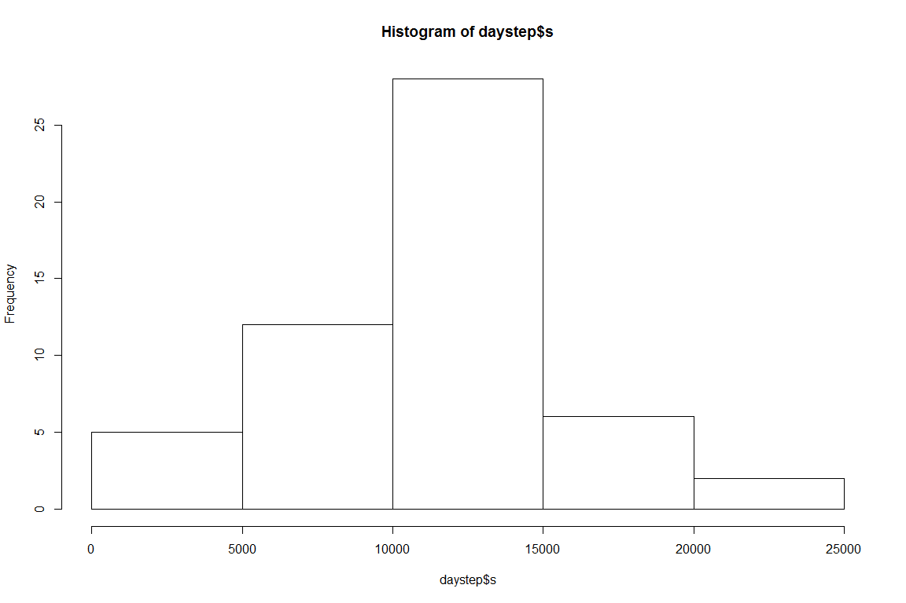
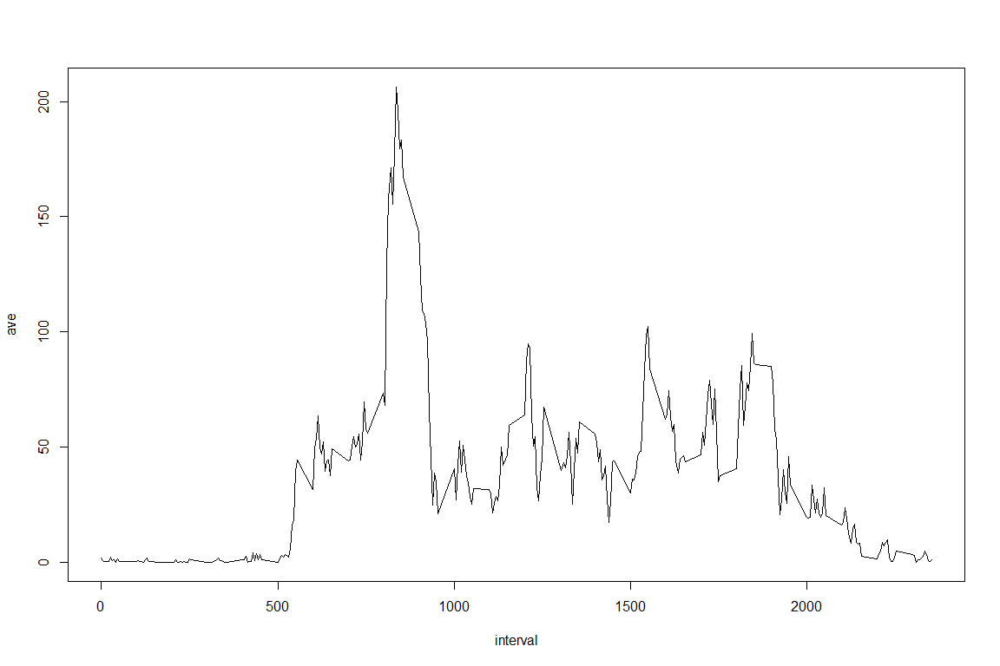
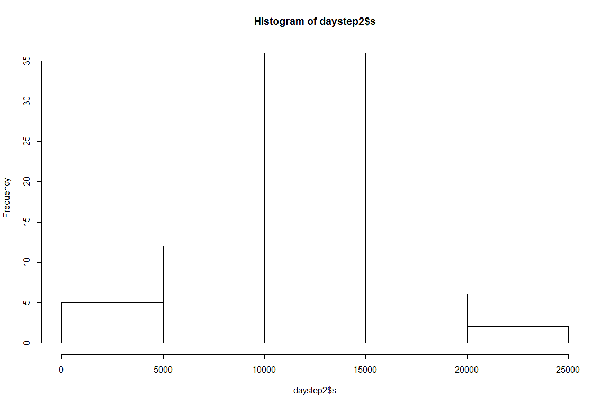

# Reproducible Research: Peer Assessment 1

```r
knitr::opts_chunk$set(fig.width=12, fig.height=8, fig.path='figure/')
```
## Loading and preprocessing the data

```r
## sourced from https://d396qusza40orc.cloudfront.net/repdata%2Fdata%2Factivity.zip
## ensure data is in working directory
rough<-read.csv("activity.csv")
library("dplyr")
```

```
## 
## Attaching package: 'dplyr'
## 
## The following object is masked from 'package:stats':
## 
##     filter
## 
## The following objects are masked from 'package:base':
## 
##     intersect, setdiff, setequal, union
```

```r
daystep<-summarize(group_by(rough, date), s=sum(steps), m=mean(steps), j=median(steps))
```

## What is mean total number of steps taken per day?

```r
hist(daystep$s)
```

 

1. The mean of the total number of steps taken is 10766.19.  

2. The median of the total number of steps taken is 10765.00.  

## What is the average daily activity pattern?

```r
intstep<-summarize(group_by(rough, interval), ave=mean(steps, na.rm = TRUE))
plot(intstep, type='l')
```

 

## Imputing missing values

```r
totnas<-sum(is.na(rough$steps))
## source: http://www.mail-archive.com/r-help@r-project.org/msg58289.html

library("plyr")
```

```
## -------------------------------------------------------------------------
## You have loaded plyr after dplyr - this is likely to cause problems.
## If you need functions from both plyr and dplyr, please load plyr first, then dplyr:
## library(plyr); library(dplyr)
## -------------------------------------------------------------------------
## 
## Attaching package: 'plyr'
## 
## The following objects are masked from 'package:dplyr':
## 
##     arrange, count, desc, failwith, id, mutate, rename, summarise,
##     summarize
```

```r
impute.mean <- function(x) replace(x, is.na(x), mean(x, na.rm = TRUE))
impsteps<-ddply(rough, ~ interval, transform, steps = impute.mean(steps))
impsteps<-impsteps[order(impsteps$date), ]
detach("package:plyr", unload=TRUE)
smostep<-summarize(group_by(impsteps, interval), ave=mean(steps))
plot(smostep, type='l')
```

 

1. The total number of missing values in the dataset before imputing are 2304. Imputing was done by calculating the mean of each of the time intervals and the using those means to replace all NAs within matching time intervals.


```r
daystep2<-summarize(group_by(impsteps, date), s=sum(steps), m=mean(steps), j=median(steps))
hist(daystep2$s)
```

 


1. The mean of the total number of steps taken from the imputed set is 10766.19.  

2. The median of the total number of steps taken from the mputed set is 10765.00.  

3. Imputing values did not significantly change the means and medians, not unexpected given that means were used to replace NAs.

4. This histogram demonstrates that imputing values created many more days reflecting more activity than before. 

## Are there differences in activity patterns between weekdays and weekends?
